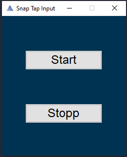

# Snap-Tap-Input 
A python based software, including a GUI, based on Razers Snap-Tap keyboard, but with the goal to make it accessible for all keyboards. 

Snap Tap Input is a free to use, public displayed alternative for every keyboard, which doesnt interact with any game data. 
Moreover it is a simnple programm, which doesnt intervene with your deviuces performance. 

It can be used in EVERY GAME, which uses movening to the left and right with either 'a' and 'd' or 'left arrow' and 'right arrow'.

## Download

**[Download Snap-Tap-Input for all keyboards](https://github.com/BenHrzr/Snap-Tap-Input/releases)**

## Example

Normally, pressing 'a', while the button 'd' is pressed, the character would stand still. 
Snap Tap Input will automatically realse the 'd' button for you, which leads to no standing still and a quicker movement in EVERY GAME.

## How to use / extract 

  1. Download the **Snap-Tap_Input.exe** file from the 'Download' / 'Releases' section.

  2. Open the Download folder
                                                
  3. Open the **Snap-Tap-Input.exe** file

  4.   press 'Start' to start the programm.
      
       press 'Stopp' to stop the programm.

       
  
  5. CLose the window afterwards. 

## License 

all rights reserved.

## Update Log

  04.08.24 -> Added the first version
